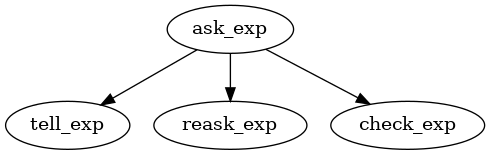

# AutoGRAMS

This is the official documentation of the [AutoGRAMS framework](https://github.com/autograms/autograms). AutoGRAMS, or autonomous graphical agent modeling software, is an agent framework and a high level programming language that combines machine instructions with language instructions, and supports concepts such as function calls and memory within the language. AutoGRAMS programs, which we refer to as "autograms" or autonomous programs, are represented as graphs, allowing users to easily program tree or graph networks of prompts into chatbots. The long term vision of AutoGRAMS is to become a language that AI uses to program AI (or re-program itself). This section includes the introduction and guide to getting started.


## Introduction

While the AutoGRAMS framework can be used as a complex programming language, the initial motivation and applications were relatively simple. Often LLM model's struggle to lead conversations that require multiple conversational steps that can take several trajectories. Let's say you want an LLM to teach someone something or interview a person about a topic. If you simply give the model a prompt at the start, it will do pretty well for the first turn. However, if you try to get it to follow a complex script, it will often veer off from this, and just go wherever the user takes the conversation. While being more reactive to the user can be useful, the ability to proactively lead a conversation according to a script or series of steps is also important. One way to better control this is to design a tree or graph of instructions for the model, instead of simply having a prompt at the start. The idea is that the model starts off with a single instruction, but depending on how the user responds, the instruction that the model receives at the next turn will be different. AutoGRAMS allows you to consider the tree of possible situations that an agent might encounter, and preprogram an instruction for each of those situations. This works by defining a graph using a spreadsheet or in python, where each row of the spreadsheet is a node in the graph.  

Let's consider an example of how this can work. Let's say we want the model to act as a recruiter and asks the user their salary expectations. After receiving the user's reply, the agent must chose which of potentially several nodes it should transition to next. To do this, it can use a predefined multiple choice question such as 

Which is the following did the user do?


A. The user asked a question

B. The user avoided the question or said they weren't sure

C. The user gave a salary range

We can then use a language model to predict, based on the user's response, whether the answer should be A, B, or C. Then, the agent can jump to a different predefined node depending on which answer the agent predicted. This allows for instructions to be given to the model situationally, allowing for more complex multi-turn instructions to be executed. 




For many users, the above usecase of designing trees or graphs of situational instructions may be the main usecase of AutoGRAMS. However, after implementing this basic functionality, we realized the utility of giving this type of framework more flexibility. So we decided to develop a full programming language that uses variables, memory, functions (even recursion), and external python calls, built around this idea of AI agents as graphs. 


## Installation and Requirements

You can install with `pip install autograms` or clone the repository and use `pip install .` in the top level directory. You will need python 3.9 or greater. 

- To be able visualize AutoGRAMS graphs, install graphviz, which can be done in linux with: `sudo apt install graphviz`

- Will require using an openai api key to run Open AI models. The fastest way to start is to set the api key in the in the environment, which can be done in linux with:
      `export OPENAI_API_KEY=[your key]` 

      If you'd prefer to store your api key in a file, you can open `api_keys.json`, change "load_from_env" to `false`, and set the value of "openai" to be equal to your api key. 


- Will require installing pytorch to run the huggingface models.


## Programming an autogram

Programs in AutoGRAMS are represented as a set of nodes, each which contain a series of fields. Most importantly, each node has an action, node, instruction, transition question, and transition choices.


1. name -- unique identifier for the node
2. instruction -- instruction for executing node
3. action -determines how the instruction should be interpreted. For instance, depending on the action, the instruction could be 
      - a prompt for a language model that gives a conversational reply
      - a prompt for a language model that reasons internally
      - code that sets a variable or calls an external api, 
4. transitions -- a list of references to the `name` identifiers of other nodes. These are nodes that can be selected next after executing a node 
5. transition_question -- multiple choice question that will help govern which transition to pick
6. transition_choices - list of possible answers to the multiple choice question that will help govern which transition to pick


For each node that is visited

1. Executing the node to apply the instruction. Depending on the action, this may result ina  conversation reply
2. Chose what node to visit next using the transitions, transition question, and transition choices. 


There are several ways to program these nodes. When coding in pure python, nodes can be added using the autogram.add_node() method

```
autogram.add_node(
      action = "chat",
      name = "ask_problem",
      transitions = ['answer_right', 'answer_wrong'],
      instruction = "Ask the user a simple 1 digit multiplication problem.",
      transition_question = "Is the users answer correct?",
      transition_choices = ['yes', 'no'],
      )
```
The above node could be used in an AI tutor that asks the user questions, and goes to a different part of the graph depending on whether the user's answer is right or wrong. When the node executes, the language model will generate text with a prompt that incorporates `"Ask the user a simple 1 digit multiplication problem."`. After the user's answer, the language model will ask itself the `transition_question`, and if based on the user's answer, the language model thinks the user got the problem right (the language model predicts yes when asked the `transition_question`), it will go to a node called `answer_right`, and if the language model thinks the user got the problem wrong (the language model predicts "no" when asked the `transition_question`), it will got to the node `answer_wrong`. Nodes for `answer_right` and `answer_wrong` could then be implemented to handle how the designer wants the chatbot to reply in those scenarios.


### Methods of implementation


 There are several ways to design AutoGRAMS nodes. If you'd like to get started, coding directly in python like the example above may seem most familiar. If you'd like to code very advanced programs, AutoGRAMS compiled from python allows for more advanced features like combining interconnected nodes with standard python code and loops, although these more advanced features aren't necessary to use it. The 3 options for implementing an autogram right now are:


1. Code directly in pure python

      One straightforward way to code nodes is to program nodes it to just define them add them one by one to to the autogram. This has the upside that it manipulates the data structure representing the AutoGRAM directly--all other methods are eventually converted to the pure python representation. Coding directly in python is also going to be most familiar to most users.

      The downside of pure python is that ironically, it is more difficult to implement autograms that integrate python code. Nodes can execute python code, however in pure python this code needs to be passed to a node as a string, which may be inconvenient and more difficult to read. AutoGRAMS nodes are also inherently capable of implementing features such as loops and conditionals, however coding these requires nodes to be set and connected in the right way. 


2. AutoGRAMS compiled from Python

      This approach gives the flexibility of writing code--including loops, Python statements, and variable assignments, directly in Python, while also incorporating AutoGRAMS graph nodes. The .py file is read and compiled into an AutoGRAMS graph automatically--So for instance if you write a forloop around an AutoGRAMS node, the AutoGRAMS compiler will make new nodes automatically to handle the forloop and the resulting AutoGRAMS graph will loop back on itself. 


3. Code in a spreadsheet


      Spreadsheets are potentially useful since most programs in AutoGRAMS consist mainly of string fields such as instructions, questions, and answers, and defining each node as a row in a spreadsheet, and each field as a cell in a spreadsheet, could be convenient for this. Describing the tree of a simple chatbot is fairly straightforward spreadsheet--you need to define the node names in one column and comma separated transitions in another field.


In the future, we also plan to have a graphical interface that allows autograms to be programmed more visually.

## Simple "getting started" example

We will start with a simple example in pure Python. We start with pure Python because other methods of implementation are mapped to a pure Python, making it the most useful starting point for understanding AutoGRAMS.


Let's say we have an agent that offers to tell the user about recent advances in AI. If the user wants this, it continues with this. Otherwise it asks the user what they would prefer to talk about.


<iframe src="agent_graphs/simple_chatbot/full_graph.html" width="100%" height="300px"></iframe>
Click on a node in the graph above to view fields.


Lets create a new file called `run_simple_example.py`. The same example can be found in the tutorial_examples/simple_example folder. Let's initialize the autogram


```
from autograms import Autogram, AutogramConfig
import json

API_KEY_FILE = "../../api_keys.json"
with open(API_KEY_FILE) as f:
      api_keys = json.load(f)

#arguments to autogram config allow default settings to be changed
config = AutogramConfig()

#initializes incomplete autogram that we will add nodes to
autogram = Autogram(api_keys=api_keys, config=config)
```
In the above code, we loaded the api key file and initialized an agent config with the default arguments. If you would prefer to run this tutorial with a huggingface model instead of an openai model, assuming you have pytorch installed, you can instead do:

```
api_keys ={}
config = AutogramConfig(classifier_type="huggingface",chatbot_type="huggingface",\
  chatbot_path="mistralai/Mistral-7B-Instruct-v0.1",classifier_path="mistralai/Mistral-7B-Instruct-v0.1")
autogram = Autogram(api_keys = api_keys,autogram_config = config)

```


Nodes can be coded in Python directly by adding them to an autogram object one by one using the autogram.add_node() method. 


```
autogram.add_node(
      action = "chat_exact",
      name = "ask_question",
      transitions = ['tell_about_ai', 'ask_user_preference'],
      instruction = "Would you like me to tell you more about the latest advances in AI?",
      transition_question = "Does the user want to talk about ai?",
      transition_choices = ['yes', 'no'],
      )
```
You can name nodes whatever you want, but choosing meaningful names can help because 
1. you need to reference these names in transitions to connect nodes 
2. The node names show up when you do visualizations of the graph

The first node added will be the first node in the graph, unless another node is later given the special name "start1". In the case above, the first node gives an `instruction` to tell the user "Would you like me to tell you more about the latest advances in AI?", as listed in the instruction field. We name the node "ask_question". 

The action field defines the action that is performed in a node, which also defines what type of node it is. A `chat_exact` node tells the agent to reply with the exact text that it in the instruction, and does not actually call the underlying chatbot language model. These types of nodes are often useful for introducing agents on the first conversation turn. The rest of the nodes are `chat` nodes, Where the model is told to follow the instruction to reply to the user, which calls the chatbot language model.

The way this agent moves through the graph will be dependent on the user's answer, and is defined by the transitions, transition question, and transition choices. The "transitions" field expects a  list of nodes that the agent can transition to next. For nodes that allow for multiple transitions, the order of the transitions matters, since they need to be aligned with the transition choices. In the node `ask_question`, there are 2 transitions defined-- `tell_about_ai` and `ask_user_preference`, and we will still need to define new nodes for these transitions. There is also a transition question--`Does the user want to talk about ai?` and 2 transition answers, `transition choice a`, which is `yes`, and `transition choice b`, which is `no`. The way that these nodes works is:

1. agent executes the instruction, in this case, replying with the exact text "Would you like me to tell you more about the latest advances in AI?"
2. The agent waits for a response, in this case, the user reply
3. The same node then asks the classifier (Which is also a language model) the `transition question`:`Does the user want to talk about ai?`
4. The classifier predicts an answer-the agent limit the predictions of the classifier to just `yes` and `no`for yes/no questions, and 'A-Z' for non yes/no multiple choice questions.
5. the answer is used to pick the transition. Since `yes` is the first answer, if the answer to the question is predicted to be yes, the agent will transition to `tell_about_ai`. Otherwise it will transition to `ask_user_preference`

For nodes with only one transition, steps 3-5 are skipped since the transition is deterministic. Therefore, no transition question or choices are needed. 

We need to define nodes for `tell_about_ai` and `ask_user_preference`, so let's do that below. Both of these nodes will transition to a single new node called `continue_conversation`. No `transition_question` or `transition_choices` are needed since there is only one possible transition for each of those nodes.

```
autogram.add_node(
      action = "chat",
      name = "tell_about_ai",
      transitions = ['continue_conversation'],
      instruction = ("Tell the user about the latest advances in AI. Mention that"
        "a new framework called AutoGRAMS was recently released that allows greater control over AI agents."),
      )

autogram.add_node(
      action = "chat",
      name = "ask_user_preference",
      transitions = ['continue_conversation'],
      instruction = "Confirm with the user the user what they would prefer to talk about.",
      )
```


Let's add the final node to the autogram. `continue_conversation`, connects to itself, allowing the conversation to continue indefinitely.

```
autogram.add_node(
      action = "chat",
      name = "continue_conversation",
      transitions = ['continue_conversation'],
      instruction = "Respond to the user.",
      )
```


Let's finalize the initialization of the autogram. Once we have defined all the nodes, the autogram checks to be sure that the nodes and transitions we defined are valid.

```
autogram.update(finalize=True)
```

We can view an interactive graph of the autogram we've just created.


```
from autograms.graph_utils import visualize_autogram

visualize_autogram(autogram,root_path="simple_example")
```
Running this will create several files including `simple_example.html`. You can try opening `simple_example.html` in a browser and click on different nodes in the graph to see the fields we have set.

Finally, we would like to interact with the autogram, so let's create an interactive terminal to do this

```
memory_object=None
user_reply=""
while True:
      reply,memory_object = autogram.reply(user_reply,memory_object=memory_object)
      print("Agent: " + reply)
      user_reply = input("User: ")
```

As long as your api_key.json file is set correctly, running the program with: 
`python simple_example.py` 

should create an interactive terminal to run the chatbot. Notice how the chatbot's second reply should follow a different instruction depending on your answer to the first question. Building larger conversation trees that adapt to a broader range of user behaviors is one of the main purposes of AutoGRAMS.


## Compiling AutoGRAMS from Python

In order to allow Python code, loops, and conditionals to be directly implemented in combination with AutoGRAMS nodes, we created a compiler that converts Python code into AutoGRAMS graph, allowing Python code and AutoGRAMS nodes to be interleaved. This code is not true Python, but behaves identically for simple Python programs in most cases, other than the AutoGRAMS nodes which behave differently. The idea is that pure Python statements and external function calls are treated as special "python_function" nodes that call the Python interpreter, and loops and conditionals can be used to form an AutoGRAMS graph automatically. Each (non-Python) AutoGRAMS node is implemented using a special built in method called exec_node(), which takes the same arguments as autogram.add_node(). The main difference is that in compiled AutoGRAMS, the order of nodes can be used to infer transitions. If nodes do not have transitions, nodes are executed in the order they appear in the code. nodes can also use a special "next" transition that simply goes to the next node or line of code. AutoGRAMS compiled from Python need to be implemented in a separate file from the code that runs the autogram, so let's create a new file called `simple_example_compiled.py`.


No imports are needed in `simple_example_compiled.py` since these are handled by the AutogramConfig when the autogram actually runs. The nodes of the simple program can be implemented as follows:

```
#the "next" transition, which will go to "tell_about_ai" since it is next in the code.
exec_node(
      action = "chat_exact",
      name = "ask_question",
      transitions = ['next', 'ask_user_preference'],
      instruction = "Would you like me to tell you more about the latest advances in AI?",
      transition_question = "Does the user want to talk about ai?",
      transition_choices = ['yes', 'no'],
      )

exec_node(
      action = "chat",
      name = "tell_about_ai",
      transitions = ['before_while'],
       instruction = ("Tell the user about the latest advances in AI. Mention that"
        "a new framework called AutoGRAMS was recently released that allows greater control over AI agents.")
      )

#will automatically transition to next defined node if no transitions defined
exec_node(
      action = "chat",
      name = "ask_user_preference",
      instruction = "Confirm with the user the user what they would prefer to talk about.",
      )

exec_node(
      action = "chat",
      name = "continue_conversation",
      transitions = ['continue_conversation'],
      instruction = "Respond to the user.",
      )
```

Another equivalent way to code in AutoGRAMS compiled from Python uses a while loop for the last node instead of a self-transition.

```
exec_node(
      action = "chat_exact",
      name = "ask_question",
      transitions = ['next', 'ask_user_preference'],
      instruction = "Would you like me to tell you more about the latest advances in AI?",
      transition_question = "Does the user want to talk about ai?",
      transition_choices = ['yes', 'no'],
      )
exec_node(
      action = "chat",
      name = "tell_about_ai",
      transitions = ['before_while'],
       instruction = ("Tell the user about the latest advances in AI. Mention that"
        "a new framework called AutoGRAMS was recently released that allows greater control over AI agents.")
      )

exec_node(
      action = "chat",
      name = "ask_user_preference",
      instruction = "Confirm with the user the user what they would prefer to talk about.",
      )
exec_node(
      action = "transition",
      name = "before_while",
      )

#while loop connects node to itself
while True:
      exec_node(
            action = "chat",
            name = "continue_conversation",
            instruction = "Respond to the user.",
      )
```

An extra placeholder node was needed before the while loop, since nodes are unable to jump into a while loop from outside of one. This placeholder node used an action of type "transition", which is basically a node that does not execute any instruction and it's main function is to connect other nodes.


Using the while loop will result in a slightly different representation in the AutoGRAMS graph since extra nodes will handle the while loop logic, however this is functionally equivalent to using the self-transition.  Note that since this is a chat node, the loop will temporarily pause each time to get the user's response, but you probably wouldn't want to have an infinite loop of non-chat nodes. 

in a separate file, the autogram can be compiled and read. Here is code that can be used to visualize and interact with the autogram we just defined

```
from autograms.graph_utils import visualize_autogram
from autograms import read_autogram
import json

API_KEY_FILE = "../../api_keys.json"
with open(API_KEY_FILE) as f:
      api_keys = json.load(f)


autogram = read_autogram("simple_example_compiled.py",api_keys=api_keys)

visualize_autogram(autogram,root_path="simple_example_compiled")

memory_object=None
user_reply=""
while True:
      reply,memory_object = autogram.reply(user_reply,memory_object=memory_object)
      print("Agent: " + reply)
      user_reply = input("User: ")

```

The `read_autogram()` method can also accept a autogram_config argument, so for a huggingface autogram you could instead use 

```
from autograms import AutogramConfig
config = AutogramConfig(classifier_type="huggingface",chatbot_type="huggingface",\
  chatbot_path="mistralai/Mistral-7B-Instruct-v0.1",classifier_path="mistralai/Mistral-7B-Instruct-v0.1")
autogram = read_autogram("simple_example_compiled.py",api_keys=api_keys,autogram_config=config)
```

## coding in a spreadsheet

We can also use a spreadsheet to define 4 nodes, where each row in the spreadsheet defines a node. 

<iframe src="https://docs.google.com/spreadsheets/d/e/2PACX-1vSgcJiEpGXvXcxCppisqXtx2PAyBrj28_tJKeIUf_Thi1IR_YG4Wg3lfwlQWqSWNrUZ53YBScZmjM3P/pubhtml?gid=0&amp;single=true&amp;widget=true&amp;headers=false" width="100%" height="300px"></iframe>

 The fields are the same as in Python, except that fields associated with transitions are comma separated lists. Instead of having a list for transition transition choices, transition choices are defined as separate fields (`transition_choice_a`, `transition_choice_b`, ..., etc.). Fields in spreadsheets (unlike in Python) are case insensitive and can use spaces and underscores interchangeably--both are converted to underscores when mapping to fields in Python.


The csv autogram can be visualized and interacted with from Python as follows:

```
from autograms.graph_utils import visualize_autogram
from autograms import read_autogram
import json

API_KEY_FILE = "../../api_keys.json"
with open(API_KEY_FILE) as f:
      api_keys = json.load(f)

autogram = read_autogram("simple_example.csv",api_keys=api_keys)

visualize_autogram(autogram,root_path="simple_example_spreadsheet")

memory_object=None
user_reply=""
while True:
      reply,memory_object = autogram.reply(user_reply,memory_object=memory_object)
      print("Agent: " + reply)
      user_reply = input("User: ")

```

## Visualizing autograms with `make_interactive_graph.py`


The `make_interactive_graph.py` script in the root directory of the repository can generate interactive graphs for any AutoGRAMS agent coded in a spreadsheet or in Python. To generate the graph for the above example, you can run

python ``make_interactive_graph.py --autogram_file tutorial_examples/simple_example/simple_example.csv``

or alternatively ``make_interactive_graph.py --autogram_file tutorial_examples/simple_example/simple_example_compiled.py``

This will create several new files. Potentially most useful full be `tutorial_examples/simple_example/simple_example_full_graph.html`. This file can be opened in a browser to view an interactive visualization of the agent. You can click on any node to highlight it and view the fields for that node. 

Here is a full list of the arguments for `make_interactive_graph.py`

`--autogram_file` - the path of a .csv or .py file where your agent is coded
`--filter_category` - only graph nodes defined by `state_category` and their transitions. `state_category` is a node field that you can use to categorize nodes. This allows for partial graphs of complex programs to be used. the output files will be named after that state category instead of `full_graph` if this argument is used.
`--label_by_inst` instead of using node names to label nodes, use an abbreviation of the node instruction.
`--graph_format` for the graph image file, what image format should be saved (png, pdf, etc.)
--read_from_pure_python - if passing in a .py file, this specifies whether it is AutoGRAMS compiled from Python (default) or AutoGRAMS implemented in pure Python. In the case of pure Python, it will load the autogram initialized in the provided .py file, assuming it is named "autogram".


## Running a chatbot with `run_autogram.py`

You can use `run_autogram.py` to run a chatbot in the terminal. You need an agent file and an api key file if using any APIs.


To run the tutorial example above, you can run:
`python run_autogram.py --autogram_file tutorial_examples/simple_example/simple_example.csv --api_key_file api_keys.json --interactive`

This will create an interactive chatbot in the terminal where you can chat with the agent.


 

